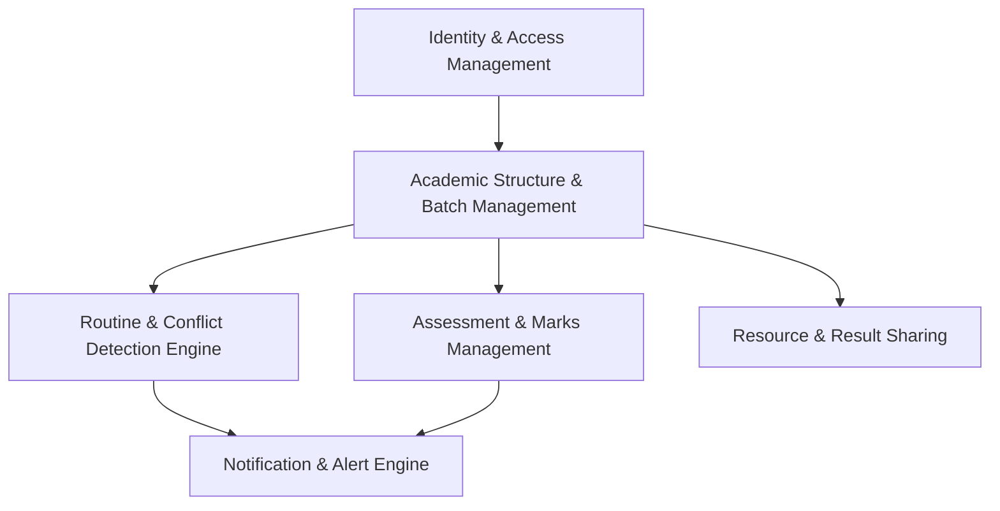

# Domain Context & Ubiquitous Language

## Project Overview
**Smart_Schedular (JU CSE Department Academic Management System)** is a comprehensive full-stack platform designed to digitize and manage the academic operations of the Department of Computer Science and Engineering (CSE) at Jahangirnagar University (JU), Savar, Dhaka, Bangladesh.

---

## Ubiquitous Language & Core Terminology

### 1. Identity & Actors
- **User**: Any authenticated entity in the system. Discriminated into 4 distinct roles:
  - **Admin**: Department office/management holding system-wide authority (preloading student/teacher rosters, managing global settings, resolving deadlocks).
  - **Teacher / Faculty**: Academic instructors who manage class schedules, conduct assessments, record marks, and request room/slot changes.
  - **Class Representative (CR)**: Designated student liaison elected per batch who coordinates routines, logs daily actuals, uploads study resources, and posts semester results.
  - **Student**: Enrolled undergraduate or graduate scholar viewing personalized schedules, notices, CT marks, and study materials.
- **Chairman**: Head of the CSE Department with administrative oversight and priority scheduling privileges.
- **Preloaded Student / Teacher**: Authoritative roster maintained by Admin for zero-friction account verification during registration.

### 2. Academic Structure & Hierarchy
- **Program**: Degree offering of the department:
  - `BSC_HONOURS` (4-year Bachelor of Science)
  - `MSC` (Master of Science)
  - `PMSCS` (Professional Master of Science in Computer Science)
  - `MPHIL` (Master of Philosophy)
  - `PHD` (Doctor of Philosophy)
- **Batch**: A cohort of students admitted in a specific academic year (e.g., Batch 51, Batch 52).
- **Semester**: An academic term (e.g., 1st Year 1st Semester, 4th Year 2nd Semester).
- **Course**: An academic curriculum unit (e.g., CSE 404: Software Engineering) with credit weight, syllabus, and assigned instructors.

### 3. Physical Facilities & Rooms
Fixed department facilities allocated for lectures and laboratories:
- **Lecture Rooms**: `R-101`, `R-102`, `R-103` (Standard lecture halls).
- **Computer Laboratories**: `R-201`, `R-203`, `R-302` (Equipped for programming & computational labs).
- **Specialized Lab**: `R-105` (Electrical Circuit & Hardware Lab).
- **Multipurpose Room**: `R-202` (Flexible space for exams, seminars, and thesis presentations).

### 4. Scheduling & Routine Engine
- **Master Routine**: The recurring baseline weekly timetable for a semester.
- **Daily Schedule Instance**: The active schedule entry for a specific calendar date, reflecting real-time statuses.
- **Time Slot**: A bounded time range (`startTime` - `endTime`) on a specific day of the week.
- **Conflict**: Any simultaneous booking overlapping across three core dimensions:
  1. **Room Conflict**: Two classes scheduled in the same room at overlapping times.
  2. **Teacher Conflict**: A faculty member scheduled to teach two classes simultaneously.
  3. **Batch Conflict**: A student batch scheduled for two activities at the same time.
- **Class State**:
  - `SCHEDULED`: Normal planned class.
  - `RESCHEDULED`: Moved to a different time slot or room.
  - `CANCELLED`: Class called off.
  - `COMPLETED`: Class successfully held.
  - `MAKEUP`: Extra session scheduled outside regular master routine.

### 5. Assessments & Results
- **Class Test (CT)**: Continuous assessment quizzes conducted during the term.
- **Assignment**: Homework or project submission with deadline and grading criteria.
- **Marks Sheet**: Tabulated scores for CTs and assignments per course.
- **Semester Final Result**: Official tabulated grade sheet/GPA report uploaded per semester.
- **Study Resource**: Downloadable academic artifact (lecture slides, notes, reference PDFs, question banks) categorized by Year and Semester.

---

## Bounded Contexts & Subdomains

1. **Identity & Access Management (IAM)**: Registration, email verification, preloaded roster validation, JWT auth (access/refresh), and role-based access control.
2. **Academic Structure & Batch Management**: Program, Batch, Semester, Course catalog, Student status lifecycle (Active, Promoted, Demoted, Graduated).
3. **Routine & Conflict Detection Engine**: Master timetable generation, daily slot instances, ACID-compliant 3-way conflict checking with row-level locks, room booking.
4. **Assessment & Grading**: CT scheduling, assignment management, marks distribution, and grade entry.
5. **Resource & Result Management**: Structured repository for course materials and semester final results with CR upload controls.
6. **Notification & Communication**: Real-time / polled alerts for routine changes, emergency cancellations, CT dates, and announcements.

---

## Architectural Principles & Conventions

- **Clean Layered Architecture (MVC)**:
  - `controllers/`: HTTP protocol only (deserialization, validation, status codes).
  - `services/`: Pure business logic, transaction boundaries, and algorithmic rules.
  - `prisma/`: Data access, relational modeling, migrations.
- **Strict Seam Testing**:
  - Services tested with unit tests (Vitest) at mockable boundaries.
  - API endpoints tested via integration tests (Supertest).
- **Defensive Scheduling**:
  - Never allow slot updates or creation without transactional conflict validation.
